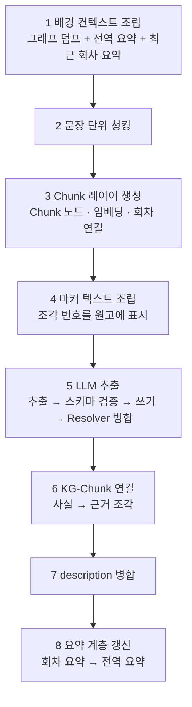
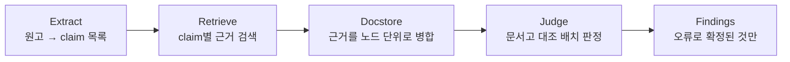

# Lorekeeper AI 파이프라인 컴포넌트 개요

> 중간 보고서용. 세 파이프라인의 구조와 각 컴포넌트의 역할·설계 의도를 설명한다.

---

## 1. Indexing Pipeline

한 회차 인덱싱은 이전 회차까지 누적된 지식 그래프 위에 새 회차를 얹는 작업이며,
**두 개의 병렬 산출**을 만든다.

1. **추출 KG** — 회차 원고에서 인물·사건·상태 등 도메인 그래프를 추출
2. **근거·벡터 레이어** — 같은 원고를 문장 단위 조각(Chunk)으로 저장·임베딩.
   추출된 모든 사실이 이 조각을 근거로 가리킨다

### 1-0. 오케스트레이터

위 단계들을 순서대로 엮는 진입점. 각 단계의 산출을 다음 단계의 입력으로 넘긴다.
순서가 곧 계약이다 — Chunk 레이어가 추출보다 앞에 만들어져야 추출기가 답하는 근거
번호가 실제 조각에 대응하고, 근거 연결은 병합(Resolver)이 끝난 뒤여야 한다.

### 1-1. Splitter

원고를 자르는 방식이 용도에 따라 둘이다.

- **추출용** — 회차 전체를 자르지 않고 통째로 하나의 입력으로 쓴다. "그", "소년" 같은
  지시가 어느 인물인지(coreference)를 회차 안에서 한 컨텍스트로 해소하기 위해서다.
- **근거용** — 한국어 문장 분리기로 잘게 쪼갠다. 이 조각이 검색의 앵커이자 판정에
  보여줄 근거 원문이라, 작아야 "어느 문장이 근거인지"를 정밀하게 짚을 수 있다.

근거 조각은 반드시 **원문의 부분문자열**로 만든다 — 문장을 재조립하지 않아야 근거를
원문과 그대로 대조하고 화면에서 해당 자리를 하이라이트할 수 있다.

### 1-2. Chunk 레이어

문장 조각들을 Chunk 노드로 저장하고 임베딩을 붙이며, 회차를 Chapter 노드로 승격해
조각들을 회차에 묶는다. 검색에 쓰일 벡터·풀텍스트 인덱스도 이 단계가 보장한다.
추출용 원고에는 각 조각의 번호를 마커로 표시해 두는데, 이 번호가 곧 Chunk 노드의
식별자가 되어 — LLM이 "이 사실의 근거는 몇 번 조각"이라고 답하면 그대로 그래프의
근거 링크로 이어진다.

### 1-3. 추출 입력 프롬프트 — Context + Extractor + Schema

추출 LLM에 들어가는 입력은 세 요소로 조립된다.

**배경 컨텍스트** — 회차마다 백지에서 추출하면 이전 회차의 인물이 새 노드로 분열한다.
그래서 세 원천을 결합해 "지금까지의 이야기"를 프롬프트에 주입한다:

| 원천 | 역할 |
|---|---|
| 전역 줄거리 요약 | 작품 전체의 흐름. 회차가 누적돼도 일정 크기를 유지하도록 매 회차 갱신 |
| 최근 회차 요약 | 직전 몇 화의 연속성 보존 |
| 그래프 덤프 | 현재까지 쌓인 인물·사건·상태의 구조 정보 |

**Extractor** — 한국어 웹소설 도메인용으로 재작성한 추출 프롬프트에 위 배경 컨텍스트와
few-shot 예시를 실어 호출한다. '새 회차 우선' 지침으로, 배경에 끌려가 새 회차 내용을
왜곡하는 것을 막는다.

**Schema** — 추출 대상 도메인 스키마. 노드는 Character / Location / Event /
Organization / Item 5종이며, **인물 상태(CharacterState) 중심 설계**가 핵심이다.
인물에 관한 사실(신분·소속·능력·부상·생사·소유·역할·인물 관계)은 전부 별도 상태
노드로 두고, 인물↔인물 관계조차 직접 간선이 아니라 상태 노드를 거쳐 잇는다 —
그래야 관계에도 성립 시점과 근거가 붙고, 바뀌면 새 상태가 쌓여 **이력이 남는다**.
스키마에 없는 속성은 검증 단계가 걸러낸다.

### 1-4. Resolver

추출은 회차마다 돌기 때문에 같은 인물·장소가 회차마다 새 노드로 생긴다. Resolver가
이를 병합하는데, 이름의 성격이 라벨마다 달라 **전략을 라벨별로 달리한다**:

| 라벨 | 전략 | 이유 |
|---|---|---|
| Character | 문자열 유사도 병합 | 표기 변형(김독자/독자/독자 씨)이 흔해 유사도로 잡는다 |
| Item / Location / Organization | 정규화 완전일치 병합 | 이름이 정준 식별자라 표기 흔들림만 흡수하고, 숫자·문자 차이는 보존해 오병합을 막는다 |
| Event / CharacterState | **병합하지 않음** | 이름이 서술형이라 어떤 유사도도 미세한 차이("왼팔 부상"/"오른팔 부상")를 뭉갠다. 근거를 가진 노드가 이 둘이라, 병합하지 않으면 근거 소실 경로 자체가 사라진다 |

병합 시 설명(description)은 버리지 않고 합쳐 두었다가 LLM으로 한 문장으로 정리한다.

### 1-5. KG-Chunk 연결

추출 그래프와 근거 원문 레이어를 잇는 지점. 추출된 사실이 들고 있는 근거 조각 번호를
실제 Chunk 노드와의 관계(EVIDENCED_BY)로 굳힌다. 이 링크 덕분에 모든 사실이
"원문 어느 문장에서 나왔는지"를 그래프 수준에서 답할 수 있다 — 탐지의 근거 인용과
화면 하이라이트가 전부 이 링크를 탄다.

### 1-6. Story 노드 (요약 계층)

마지막 단계는 다음 회차를 위한 요약 갱신이다. 이 회차를 짧게 요약해 Chapter에
저장하고, 전역 줄거리 요약(Story)에 이번 회차를 반영해 갱신한다. 이 요약들이 다음
회차 추출의 배경 컨텍스트가 되므로, 프롬프트는 간결함보다 정확성을 우선하도록
지시한다 — 요약의 오류는 이후 모든 회차의 해석으로 전파되기 때문이다. 회차(Chapter)를
작품(Story)에 잇는 이 마지막 쓰기가 "이 회차는 끝까지 처리됐다"는 완료 표지 역할도
겸한다.

---

## 2. Retrieval Tools

지식 그래프를 조회하는 도구는 셋이고, **서로 다른 좌표계에 앵커**하는 것이 설계의
핵심이다:

| 도구 | 앵커 | 강한 질의 |
|---|---|---|
| hybrid_search | 원문 표현 (Chunk) | 표기·숫자·고유명 — "그 표현이 원문에 있나" |
| fact_search | 사실·행위 (Event/CharacterState) | "누가 X를 했나" 귀속형, 규칙·제약 |
| entity_search | 엔티티 (인물·아이템·조직·장소) | 특정 대상의 속성·상태 이력 |

유사도 검색은 원리상 "질의에 있는 것과 비슷한 것"만 찾으므로, 질의에 없는 이름이
정답인 질의("이지혜가 수표를 냈다" → 실제로는 한명오)를 풀지 못한다. fact_search와
entity_search는 **닫힌 집합**(참가자 목록, 상태 이력)을 돌려줘 그 빈칸을 메운다 —
"목록에 없다"는 사실 자체가 부재 증명의 근거가 된다.

### 2-0. 공통 메커니즘

hybrid_search와 fact_search는 벡터 검색과 풀텍스트 검색을 융합하는 하이브리드
방식이다. 의미가 비슷한 것(벡터)과 표현이 일치하는 것(풀텍스트)을 함께 잡는다.
모든 도구는 테넌트(소설 한 편) 범위로 격리되어 검색이 다른 작품의 내용을 절대
넘겨보지 않으며, 격리 필터 때문에 결과가 부족해지지 않도록 후보를 넉넉히 뽑은 뒤
걸러서 요청한 개수를 채운다.

### 2-1. hybrid_search — 청크 계층

원문 조각을 직접 검색한다. 표기·숫자·고유명처럼 "그 표현이 실제로 원문에 있는가"를
확인하는 데 강하다. 결과에는 조각의 원문과 소속 회차가 실리고, 필요하면 그 조각을
근거로 삼는 사실들로 그래프를 확장할 수도 있다(기본은 끔 — 반복 설명이 근거 분량만
불리는 것으로 실측돼 껐다).

### 2-2. fact_search — 사실 계층

추출된 사건·인물상태를 의미로 검색한다. 검색 대상이 원문 전체가 아니라 정제된 사실
노드라 신호 밀도가 높다. 결과에는 세 가지가 딸려온다:

- **성립 회차** — 이 사실이 언제부터 참인지. 시점을 다투는 판정의 기준이 된다
- **참가자 목록** — 이 사실에 얽힌 인물들. 귀속형 질의의 답이자 부재 증명의 근거
- **근거 원문** — 사실이 가리키는 원문 조각을 가공 없이 그대로. 판정이 원문 표현을
  직접 대조할 수 있어야 하기 때문이다

### 2-3. entity_search — 엔티티 정형 조회

인물·아이템·조직·장소를 이름 또는 별칭으로 **정확 조회**한다(임베딩을 쓰지 않는다).
프로필(속성·인물 관계·상위 계층)과 그 대상에 걸린 사실 이력을 성립 회차 순으로
돌려준다. "몇 화까지"를 지정하면 그 시점의 스냅샷만 조회할 수 있어, 신규 회차를
검사할 때 아직 일어나지 않은 일이 근거로 새는 것을 막는다.

### 2-4. 도구 노출

세 도구는 LLM 에이전트가 부를 수 있는 도구 형태로도 노출된다. 도구 스키마에는 질의
파라미터만 열려 있고 테넌트는 조립 시점에 굳혀진다 — LLM이 다른 작품을 조회할 값을
지어낼 여지 자체를 없앤 설계다.

---

## 3. Detecting Pipeline

새 회차 원고가 기존 설정(직전 회차까지의 그래프)과 어긋나는지 검사한다.

### 3-1. Extract

원고에서 검증 대상 주장(claim)을 뽑는다. claim 하나는 네 필드다:

| 필드 | 의미 |
|---|---|
| quote | 원문 서술 (그대로 인용) |
| axis | 무엇에 대한 주장인가 (대조축) |
| value | 그 값 |
| lines | 근거 줄 번호 |

옳고 그름은 여기서 판단하지 않는다 — 원고의 주장을 구조화해 옮기기만 하고, 대조는
판정 단계가 한다. 원고 전역에 줄 번호를 매긴 뒤 여러 조각으로 나눠 병렬 추출하며,
claim 식별자는 모델이 아니라 코드가 부여해 실행마다 결정적이다.

### 3-2. Routing

claim 하나를 어떤 검색 질의로 바꿀지 **코드가 규칙으로** 정한다. LLM에게 도구 선택을
맡기면 같은 입력에도 선택이 흔들려 개선 효과를 측정할 수 없기 때문이다 — 같은 claim
이면 항상 같은 질의가 나간다. 질의는 두 계열로 만드는데 서로 상보적이다: 대조축(axis)
단독은 값이 틀린 claim에서도 대조 지점을 정확히 가리키고, 축·값 결합은 값 어휘 자체가
단서인 claim을 잡는다.

### 3-3. Retrieve

라우팅이 정한 질의 조합을 실행해 claim마다 근거를 모은다. claim 하나가 만드는 검색은
**두 질의 계열 × 두 채널 = 최대 4회**다:

| 질의 계열 | hybrid_search (원문) | fact_search (사실) |
|---|---|---|
| axis 단독 | 호출 | 호출 |
| axis + value 결합 | 호출 | 호출 |

entity_search는 열지 않는다 — 이름 조회 결과가 fact_search와 대부분 겹쳤고, 소속·소유·
무대 정보는 fact_search가 함께 실어 오기 때문이다. 검색 결과는 claim 단위로 중복을
걷어낸 뒤 문서고 조립에 넘긴다.

근거에는 **회차 상한**이 걸린다 — 검사 회차 이상의 근거를 걸러내, 회차가 자기 자신이
만든 사실과 대조되거나 이후 회차의 반전을 미리 심어둔 모순으로 읽는 것을 막는다.

### 3-4. Docstore

모든 claim의 검색 결과를 **노드 단위로 병합**한 하나의 문서고를 만든다. claim마다
근거를 따로 붙이면 같은 조각·사실이 claim 수만큼 중복돼 판정 입력이 폭증한다 —
노드 하나를 한 번만 싣고, claim은 별칭으로 그 노드를 가리킨다. 별칭은 실행마다
동일하게 매겨져(자연키 정렬) 결과를 실행 간에 비교할 수 있다.

### 3-5. Judge

claim들을 문서고와 대조해 설정 오류를 판정한다.

- **배치 1회 판정** — claim마다 따로 부르지 않고 전부 한 번에 본다. 문서고가 한 번만
  실리고, 판정기가 claim들 사이의 관계까지 보면서 판단할 수 있다.
- **판정기는 원고를 보지 않는다** — claim과 문서고뿐이다. 원고를 함께 주는 실험에서
  검출력이 오히려 떨어졌다: 근거인 문서고 대신 검증 대상인 원고를 근거로 삼기
  시작했기 때문이다.
- 판정은 점수로 나오고 임계 이상만 오류로 확정한다. 응답 파싱은 방어적이다 —
  누락된 판정을 "문제 없음"으로 메우지 않고, 판정기가 지어낸 인용은 문서고와 대조해
  걸러낸다.

최종 산출(findings)은 오류로 확정된 claim들로, 원문 인용·근거 위치(회차·조각 좌표)·
판정 사유가 함께 실려 API 서버의 테이블에 기록된다.
